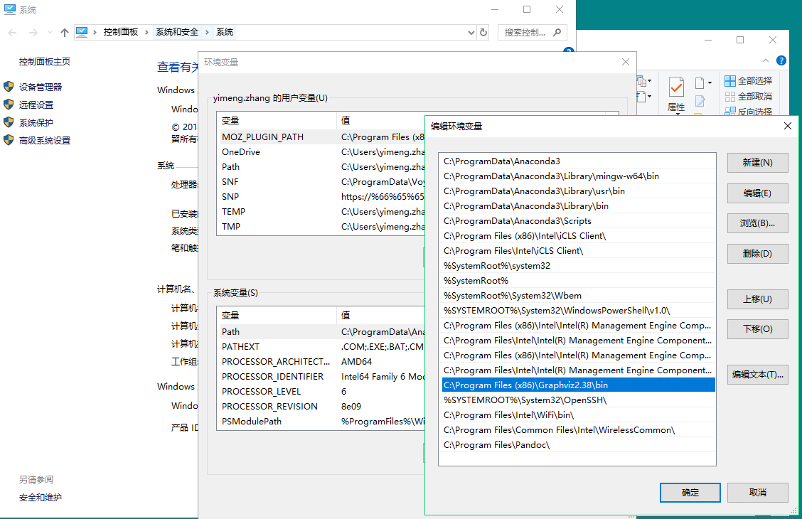

 **Instructions to run the program**

1. Install all required dependencies 
    - sklearn - ```pip install scikit-learn```
    - pandas - ```pip install pandas```
    - numpy - ```pip install numpy```
    - pydotplus - `pip install pydotplus`
    - graphviz  
                **Installing graphviz (for windows user):**
        - Download and install executable from https://graphviz.gitlab.io/_pages/Download/Download_windows.html
        - Set the PATH variable as follows
        
        - Restart your currently running application that requires the path

2. Execute rule.py and rule_extraction.py

3. Finally execute the main.ipynb.
<br><br>

**Problems faced during the project**

- Several libraries were depriciated and not supported. Especially sklearn library was quite old and the functions used corresponding were not up to date. Therefore, we were facing the majority of errors as “sklearn does not have any such function”. 

 ***How we solved the problem***
1. We updated the sklearn library version to the newest version.
2. We changed the functions which were not supported in new version of sklearn to the corresponding functions which are supported now.
3. Following are the functions that were needed to be changed in rule_extraction.py:

Old   |  New
:----:|:----:
sklearn.ensemble.bagging.BaggingClassifier    |       sklearn.ensemble.BaggingClassifier
sklearn.ensemble.bagging.BaggingRegressor       |       sklearn.ensemble.BaggingRegressor
sklearn.ensemble.forest.RandomForestClassifier  |       sklearn.ensemble.RandomForestClassifier
sklearn.ensemble.forest.RandomForestRegressor   |       sklearn.ensemble.RandomForestRegressor   
sklearn.ensemble.forest.ExtraTreesClassifier    |       sklearn.ensemble.ExtraTreesClassifier
sklearn.ensemble.forest.ExtraTreeRegressor      |       sklearn.ensemble.ExtraTreeRegressor  
<br>
4. changes in importing libraries in rule_extr.py

Old   |  New
:----:|:----:
from sklearn.externals.six import StringIO      |       from six import StringIO
from sklearn.tree import _tree                  |       from sklearn.tree import DecisionTreeClassifier, from sklearn.tree import DecisionTreeRegressor   
